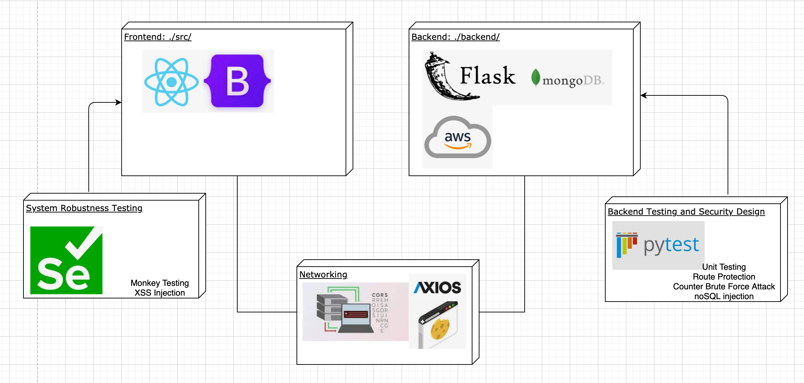

# SingHealth Retail Management App

50.003 Elements of Software Construction

Client: SingHealth - Singapore Health Services

Group 4-2 (C4G2)

## Start the app

### install dependencies:

Backend dependecies: `pip install -r requirements.txt`

Frontend dependencies: `yarn install`

### Set up local mongodb database

*Please take note that it requires `*nix` systems to run the app.*

- on Mac OS

start: `brew services start mongodb-community@4.4`

stop: `brew services stop mongodb-community@4.4`

- on other os

https://docs.mongodb.com/manual/administration/install-community/

### credentials

add the AWS credentials to your environment variables of your current python virtual environment

- `export ACCESS_KEY=xxx`

- `export SECRET_KEY=xxx`

The credentials are shared privately in the group.

### Start Localhost Server

start frontend: `yarn start`

start backend: `yarn start-api`

## Testing

Backend unittesting can be found in `/backend/tests/`

Frontend selenium testing and system robustness testing can be found in `/src/tests`

## Tech Stack

- Backend
    - [Flask](https://flask.palletsprojects.com/en/1.1.x/)
    - [MongoDB](https://www.mongodb.com/)
    - [AWS S3](https://aws.amazon.com/s3/)
 
- Frontend
    - [React](https://reactjs.org/)
    - [Bootstrap](https://getbootstrap.com/)

- Testing
    - [pytest](https://docs.pytest.org/en/stable/)
    - [Selenium](https://www.selenium.dev/)

## Contributors

- [Qiao Yingjie](https://github.com/YingjieQiao)
- [Ong Li Wen](https://github.com/24kmystique)
- [Mihir Chhiber](https://github.com/mihirchhiber)
- [Ishaan Nair](https://github.com/ishaannair)

## License

MIT
